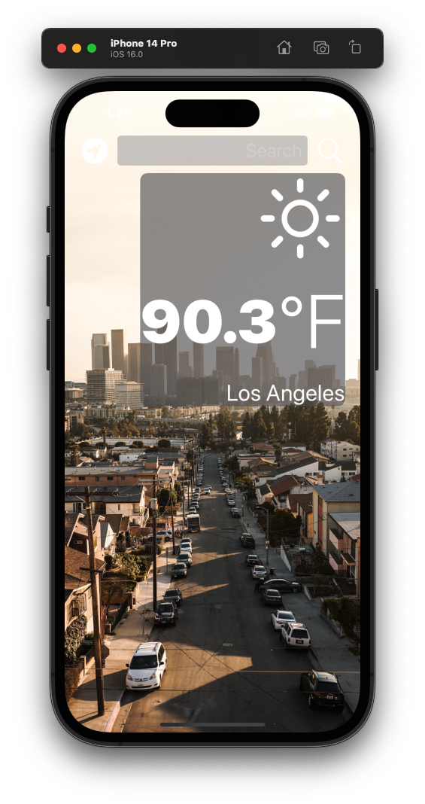
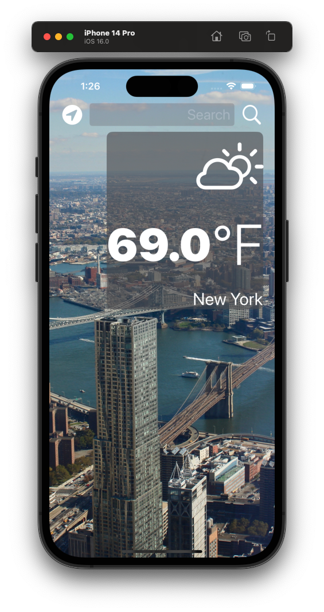

# Weather APP

This is a basic weather app where the user enters a city name and it will display the current weather.

---

## Screenshots

## How to use this app

- You must have XCode on your machine
- The clone the repo and open it in XCode
- Then type Command + R to run the app in the simulator
